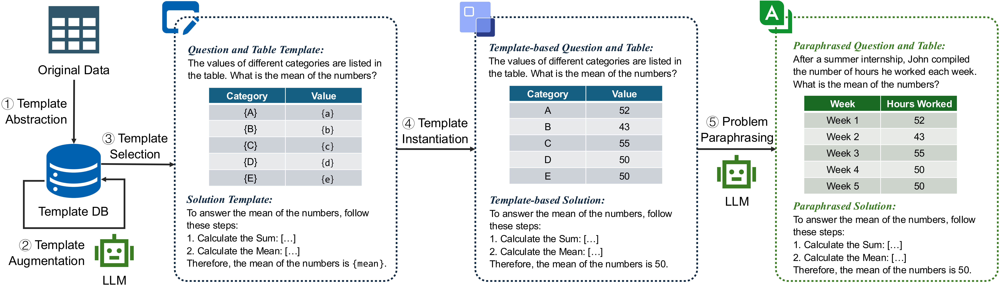

# TELL
This is official repo for the paper Template-Driven LLM-Paraphrased Framework for Tabular Math Word Problem Generation. This is overall framework.

    
     

# 25 TMWP template of main question types
see template folder
